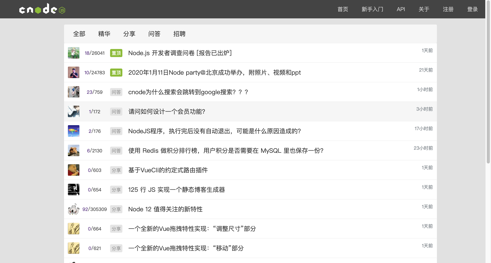
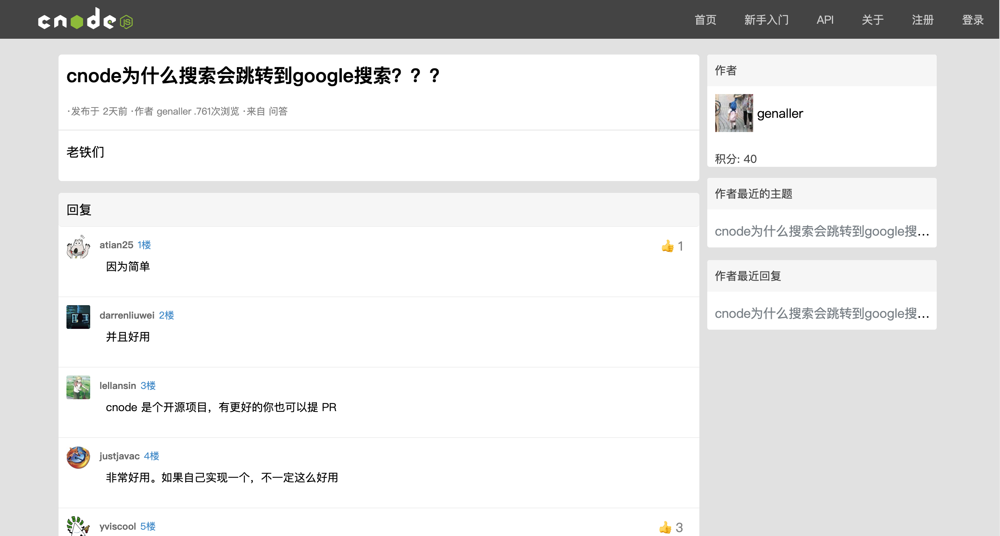
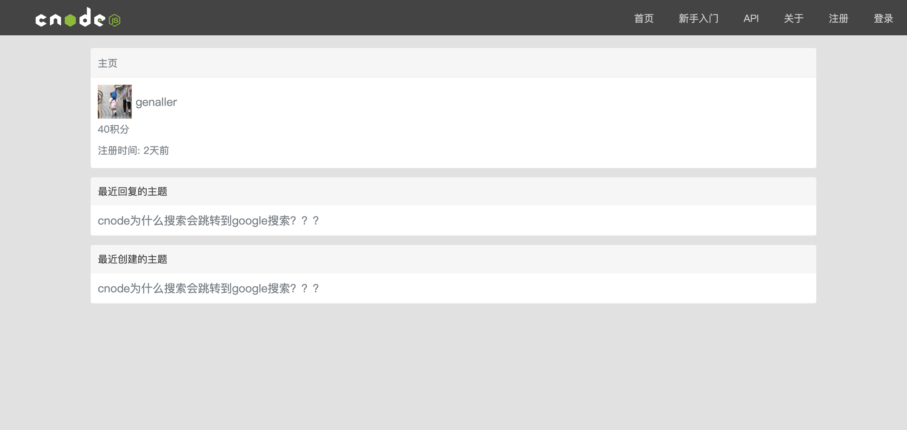

### 简版cnode轻社区
`效果`

****
### 技术栈
**JavaScript**、**ES6**、**Jquery**、**Vue**、**axios**、**Vue-router**、**vue-cli脚手架工具**、**CSS3**、**CSS3动画**、**HTML5**、**flex布局**
****
### 项目描述
运用`Vue`框架，构建一个(cnode社区)[https://52.197.183.123]，针对单页应用，编写对应的组件：
`postList`列出网站帖子组件、`Header`头部组件、`pagination`分页组件、`slideBar`侧边栏组件、`Article`单个帖子详情组件

功能： 
1. 首页展示社区用户最近上传的帖子，显示帖子的 回复数/浏览数,以及最后回复的时间。以及帖子的标签，如`精华`、`置顶`、`问答`
2. 点击帖子的标题可以跳转到 `Article`单个帖子详情组件: 展示帖子的回复详情，回复的楼层，以及单条回复的点赞数量。`slideBar`侧边栏组件`:展示用户 `作者的主题的`至多五个标题、`作者最近回复`至多五个标题、用户头像积分的信息。
3. 点击用户头像 可以可以展示用户的`userInfo`组件，显示用户更详细的基本信息(`如积分`) ，以及最最近创建及回复的帖子的标题。
4. 点击头部 登录/注册，弹出登录/注册框。在注册科头部点击登录或是注册选项可以，切换登录/注册窗口。
注： 实际不能`登录与注册`
*****
`注`: 由于某些`API`无法获取，无法完成cnode社区的全部功能。该项目的主要目的是在阅读过`Vue`文档过后，对`Vue`框架基础知识包括**vue组件**、**vue-router**、**Vue指令**、**钩子函数**等知识的一次一次综合实战运用

